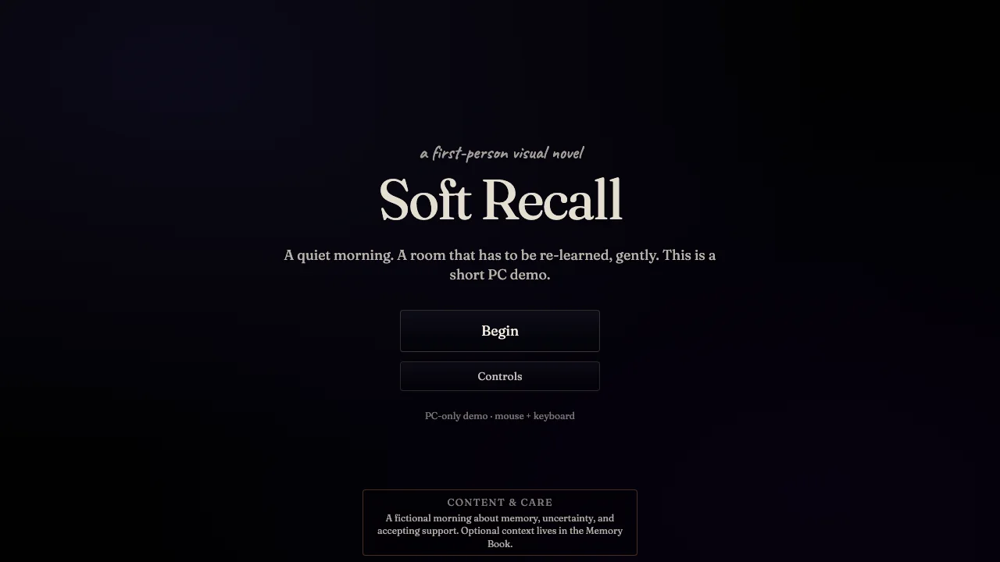

# Soft Recall Demo

Soft Recall Demo is a static Vite React single-page game for PC browsers. It is a first-person point-and-click visual novel demo about memory, routine, uncertainty, and care.



The active build is desktop-first and deploys to GitHub Pages. It does not use a backend, auth, database, voiceover, music, or sound effects.

## Play

- [Play on itch.io](https://siamakenna.itch.io/soft-recall-demo)
- [Play on GitHub Pages](https://siamakenna.github.io/soft-recall-demo/)

For the current desktop release, use a browser window of at least 900 x 600 or launch fullscreen.
Release QA covers 1280 x 720, 1440 x 900, and 1920 x 1080. See the [0.3.0 release notes](docs/release/RELEASE_NOTES_0.3.0.md) for browser coverage and limitations. Storefront uploads are separate from GitHub Pages deployments.

## Play Locally

```bash
nvm use
npm install
npm run dev
```

Node 24 is recommended and pinned in `.nvmrc`; `nvm use` is optional when Node 24 is already installed.

Build and preview the production version:

```bash
npm run build
npm run preview
```

The production build should create `dist/index.html`.

## Current Scope

- Static Vite React SPA
- First-person scene art and point-and-click hotspots
- Doorways navigation fallback
- Memory Book
- Silent, pausable/skippable camera films and four optional room stories
- Drag interactions with keyboard/button alternatives
- Saved progress, motion controls, and reversible atmospheric distortion
- Three-ending demo route
- PC-only manual QA route
- GitHub Pages deployment with base path `/soft-recall-demo/`

## Professional Documentation

- [Wiki index](docs/WIKI_INDEX.md)
- [Runners](docs/RUNNERS.md)
- [Repository settings checklist](docs/process/REPO_SETTINGS_CHECKLIST.md)
- [Playthrough QA](docs/qa/PLAYTHROUGH_QA.md)
- [Release process](docs/release/RELEASE_PROCESS.md)
- [0.3.0 release notes and verification](docs/release/RELEASE_NOTES_0.3.0.md)
- [itch.io release guide](docs/release/ITCH_RELEASE.md)
- [Playtest guide](docs/qa/PLAYTEST_GUIDE.md)
- [Agent guidance](docs/agents/AGENTS_OVERVIEW.md)
- [Contributing](CONTRIBUTING.md)
- [Support](SUPPORT.md)
- [Security](SECURITY.md)
- [Privacy](PRIVACY.md)
- [Credits](CREDITS.md)
- [Changelog](CHANGELOG.md)

## Required QA Route

Title -> Begin -> Tutorial -> Bedroom -> glasses -> note -> phone choice -> Hallway -> Kitchen -> Hallway -> Bathroom -> Hallway -> Memory Book -> Front Door -> Ending

## Disclaimer

Soft Recall Demo is narrative and research-informed. It is not medical advice, diagnosis, screening, treatment, or a clinical assessment tool.
